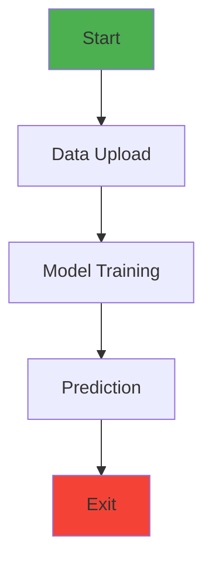
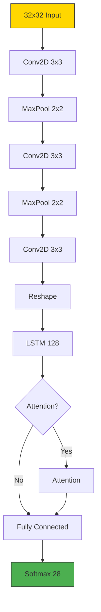

# Arabic Handwriting Recognition System


Final Year Project @ Bradford College

Supervised by Dr. Sokyna

Developed by Osama Rabih

**Final year project** - A deep learning system for recognising handwritten Arabic characters using a hybrid CNN-LSTM architecture with optional attention mechanism, deployed as a Streamlit web application.

Live Demo -> [](https://arabic-handwriting-recognition.streamlit.app/)


## 🚀 Features

  - **Hybrid Architecture**: Combines CNN for spatial features and LSTM for sequential patterns
  - **Attention Mechanism**: Optional attention layer for improved performance
  - **Full Pipeline**: 
    - Data loading and preprocessing
    - Model training with progress tracking
    - Interactive testing and prediction
  - **User-Friendly UI**: 
    - Drawing canvas for character input
    - File upload support
    - Real-time visualisation 
    
    ## Table
| Feature | Description |
|---------|-------------|
| **Hybrid Architecture** | CNN for spatial features + LSTM for sequential patterns |
| **Attention Mechanism** | Optional attention layer for improved accuracy |
| **End-to-End Pipeline** | Data loading → Training → Testing → Prediction |
| **Interactive UI** | Drawing canvas + file upload + real-time visualization | 

## 📦 Installation
**Prerequisites**
  - Python 3.8-3.11
  - pip or conda

### Local Setup

1. Clone the repository:
   ```bash
   git clone https://github.com/OsamaRabih/arabic-handwriting-recognition.git
   cd arabic-handwriting-recognition

2. Create and activate virtual environment:
   ```bash
   python -m venv venv
   source venv/bin/activate  # Linux/Mac
   venv\Scripts\activate     # Windows

3. Install dependencies:

   ```bash
   pip install -r requirements.txt

## 🖥️ Usage

**Running Locally**: 
Write this command to run the system in your local machine
```bash
streamlit run main.py
```
## Application Workflow

1. Training Page:
    - 📊 Upload CSV datasets (features and labels)
    - ⚙️ Configure model with/without attention
    - 📈 Monitor training progress
2. Testing Page:
    - 🧪 Evaluate model performance
    - 👀 View sample predictions
3. Results Page:
    - 👀 Visualise training metrics →
    - 📤 Export model performance data
4. Prediction Page: 
    - ✍️ Draw characters OR 📤 Upload images
    - 🔮 Get real-time predictions
 5. Exit Page:
	- Select [Yes] confirmation button

###  Visual Workflow Summary

## 🧠 Model Architecture


## 📂 Project Structure

	📦 arabic-handwriting-recognition
	├── 📂 classes
	│   ├── 📄 DataHandler.py   # Data loading/preprocessing
	│   ├── 📄 ModelTrainer.py  # Model building/training
	│   └── 📄 Predictor.py     # Prediction logic
	├── 📂 st_pages
	│   ├── 📄 train_page.py    # Training interface
	│   ├── 📄 test_page.py     # Testing interface
	│   ├── 📄 results.py	    # Results visualization
	│   ├── 📄 predict_page.py  # Prediction interface
	│   └── 📄 exit_page.py     # Application exit
	├── 📂 tests
	│	├── 📄 black_box.py		
	│	└── 📄 white_box.py		# White Box Code
	├── .streamlit/ 			# Configuration
	│	└── secrets.toml 		# Local secrets
	├── 📄 main.py              # Main application
	├── 📄 requirements.txt 	# Dependencies
	└── 📄 README.md 			# This file includes the project discription
	
## 🌐 Streamlit Cloud Deployment
1. Fork this repository
2. Go to Streamlit Cloud [https://share.streamlit.io/]
3. Click "New app" and connect your GitHub
4. Set:
    - **Repository**: OsamaRabih/arabic-handwriting-recognition
    - **Branch**: main
    - **Main file path**: main.py
5. Configure secrets in Settings if needed

## 🧪 Testing
### Run tests

Test this system via running this code:
```bash
pytest tests/ -v
# Check coverage and generate the report
coverage run -m pytest tests/
coverage report -m
```

## 🤝 Contributing
1. Fork the project
2. Create your feature branch
	```bash
	git checkout -b feature/Amazing Feature
 
3. Commit your changes 
	```bash
	git commit -m 'Add some amazing feature'
	```
4. Push to the branch 
	```bash
	git push origin feature/Amazing Feature
	```
5. Open a Pull Request

## 📜 License
Distributed under the MIT License. See LICENSE for more information.

## 📧 Contact
**Final year project**

**Osama Rabih** - rabih.osama91@gmail.com

**Project Live Link** : [Go Live Here](https://arabic-handwriting-recognition-system.streamlit.app/)
